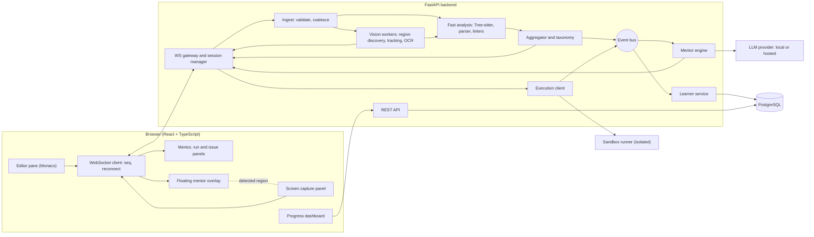
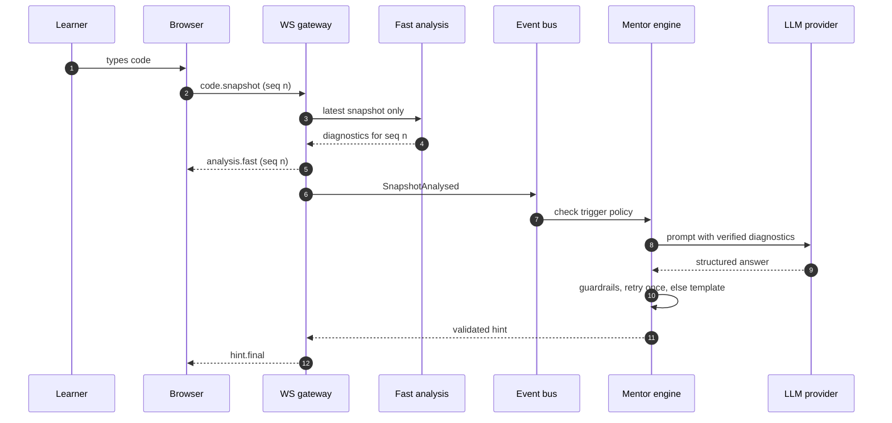
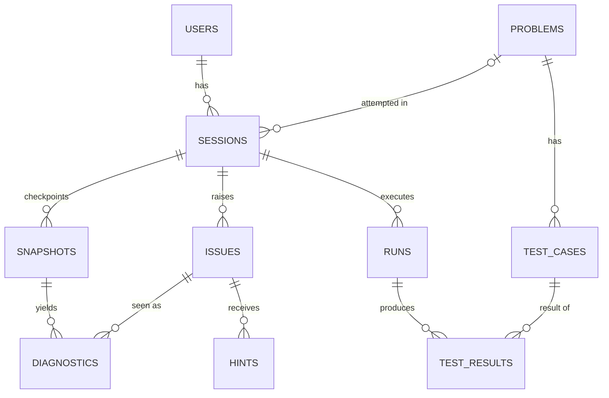
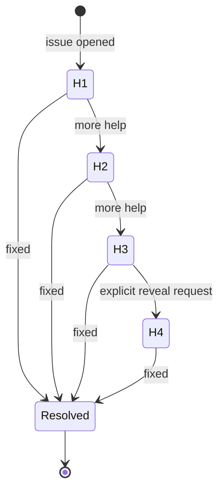

# 03 — Architecture

Proposed design v0. Every part that depends on an unanswered question is marked `[Qn]` and isolated behind an interface, so an answer changes one module, not the whole system. Numeric values live only in section 12 as provisional parameters (`P-nn`).

## 1. Principles

1. **Verified facts first.** Tools (parsers, linters, runtime, tests) find problems; the LLM explains them. The LLM may add a clearly labelled `suspicion`, never an unlabelled error.
2. **One snapshot contract.** Everything after ingest depends on `CodeSnapshot`, not on how the code was captured.
3. **Latest wins.** Stale work is dropped; the fast path never waits for the slow path.
4. **Untrusted code stays in the sandbox.** No exceptions.
5. **Degrade, do not fail.** The LLM, runner, database and vision module can each be off; the learner still sees markers and template explanations.
6. **The learner stays in control.** Proactivity is adjustable; the full fix appears only on explicit request.
7. **Privacy by default.** Store the minimum, never raw frames, never code in logs, redact secrets before any LLM call and before code text is stored.
8. **One source of truth for contracts.** Pydantic models generate the TypeScript types.
9. **Measure before claiming.** Every quality statement comes from the eval harness, with the sample size stated.
10. **Simple first.** In-process event bus, one backend node, interfaces only where a change is likely.

## 2. System context and decision forks

The learner uses a browser. The backend talks to four external parties: the LLM provider (LM Studio's local server or a hosted API), PostgreSQL, the sandbox runner (internal only) and, in screen mode, the browser's screen-capture API.

| Fork | Options | Plan default (provisional) | Gate |
|---|---|---|---|
| Input source | editor, screen + OCR, both, VS Code extension | editor adapter first, screen adapter second | Q1 |
| Learner languages | Python, plus C++ and/or Java | Python first, others in PH8 | Q2 |
| Oracle for logic errors | free-form, problem bank with tests, pasted statement | tests when present, `suspicion` otherwise | Q3 |
| LLM | local, hosted, both | provider interface; model picked by bake-off | Q4 |
| Users | single local profile, hosted with accounts | `user_id` on every record; single local profile | Q5 |
| Code execution | hardened runner on the server, in-browser WebAssembly Python, hosted execution service | hardened runner | Q2, Q5 |
| Database | PostgreSQL in Docker, Supabase-hosted PostgreSQL | PostgreSQL via standard drivers | Q12 |

In-browser execution (Python compiled to WebAssembly, run in a Web Worker) removes server-side execution risk but supports Python only and needs its own stdin and timeout handling. It is worth evaluating only if Q2 = Python only and Q5 = hosted.

## 3. Component view



| Component | Responsibility | Code location | Optional |
|---|---|---|---|
| WS gateway | Connections, Origin check, size limits, message routing | `backend/app/ws/` | no |
| Ingest | Validate and normalise snapshots; latest-wins coalescing | `backend/app/ingest/` | no |
| Vision workers | Frame decode, preprocessing, automatic code-region discovery, region tracking, OCR and code reconstruction | `backend/app/vision/` | yes (screen source) |

Automatic region discovery and tracking are deliberately separate modules (`code_region_detect.py` and `region_tracking.py`) so their evaluation and failure behavior can be tested independently of the OCR engine.
| Fast analysis | Tree-sitter, precise parser, linters; no code execution | `backend/app/analysis/` | no |
| Aggregator | Dedupe, rank, taxonomy mapping, fingerprints, issue matching | `backend/app/analysis/aggregator.py` | no |
| Execution client | Talks to the runner; maps results to diagnostics | `backend/app/execution/` | no |
| Sandbox runner | Compiles and runs untrusted code under a hardened policy | `sandbox/` | no |
| Mentor engine | Trigger policy, ladder, prompts, LLM call, guardrails, fallback | `backend/app/mentor/` | LLM part can be off |
| Learner service | Issue lifecycle, checkpoints, metrics, adaptation | `backend/app/learner/` | adaptation is P1 |
| Problem store | Problems and test cases | `backend/app/problems/` | `[Q3]` |
| REST API | Health, history, problems, progress | `backend/app/api/` | no |
| Floating mentor overlay | Renders validated hints; positions beside detected code without blocking primary content; draggable fallback | `frontend/src/features/mentor/` | no |

## 4. Sources

### 4.1 Editor source (FR-02)

Monaco in the browser, bundled locally (D4), so the app works offline and under a strict content-security policy. The React wrapper's default loader fetches Monaco from a CDN at runtime; configure it to use the installed package and verify in the wrapper's documentation at scaffold time. A content change starts the debounce P-01, then emits a `code.snapshot` with the next `seq`, `source: editor`, `confidence: 1.0`. The language is chosen by the learner and never guessed in editor mode. Snapshots are full text in v1 (size limit P-10); deltas are a backlog optimisation.

### 4.2 Screen source (FR-19, FR-27) `[Q1 decided]`

- `getDisplayMedia` needs a secure context (HTTPS or `localhost`) and a user gesture, and the learner chooses what to share each session.
- Frames are sampled at P-13 onto a small off-screen canvas, converted to grayscale and compared with the previous sample. When the difference is above a threshold and then stays still for the settle time (P-13), the current frame is eligible for code-region discovery. Nothing is sent while the screen is changing or unchanged.
- **Automatic code-region discovery is the default.** The system evaluates candidate regions using editor-like layout, text density, line-number evidence, indentation, code-token evidence and parser success. It selects the highest-confidence candidate only when the confidence gate is met.
- The selected code region is tracked over time using visual overlap and stable layout features. A moved/resized editor produces a new `region.update`; a lost or ambiguous track pauses analysis.
- Manual region selection remains a fallback when automatic detection is below the gate or the learner explicitly overrides it.
- Controls: consent dialog before the first frame, an always-visible indicator, automatic-discovery status, manual override, pause and stop, and automatic stop when the learner leaves the page.
- Region coordinates are represented in capture-frame space and normalised so the floating mentor can be positioned consistently even as the browser viewport changes.
- Open technical question for the PH7 spike: how often background tabs sample frames (timers can be throttled). The spike measures it on your browser and OS before design is frozen.
- Binary framing for frames is decided in PH7-S1.

### 4.3 Vision pipeline (FR-20, FR-27) `[Q1 decided]`

1. **Decode and validate** (size and dimensions within P-10; reject anything else).
2. **Preprocess** with OpenCV: grayscale, scale up small text, optional thresholding. Variants are compared in the bake-off, not assumed.
3. **Discover candidate code regions:** generate bounded text/editor-like candidates from layout cues; score them with visual structure, line-number evidence, indentation, code-token density and editor chrome. This stage must not itself declare code correctness.
4. **Track the best region:** associate consecutive detections using geometry and stable visual features. If confidence drops below the P-16 region-confidence gate, emit a `source.notice` and stop analysis until the region is reacquired or manually selected.
5. **OCR** through an `OcrEngine` interface returning words with boxes and confidence. Candidates: Tesseract, at least one other open-source engine and optionally a vision-language model as a verifier. The engine is chosen by measurement (PH7-S3).
6. **Reconstruct code:** group words into lines by vertical overlap, infer indentation from left offsets relative to the character width, strip editor gutters (a left column of increasing line numbers), join wrapped lines only when evidence says so.
7. **Detect language** when the learner has not declared one, using parse success per candidate grammar.
8. **Confidence gate (P-16/P-14):** combine region confidence, OCR confidence, parse success and gutter detection. Below the gate, no diagnostics are produced; the learner sees a `source.notice` suggesting manual selection, a tighter view, a larger font or the editor source. OCR text and region guesses are never treated as ground truth.

The reconstructed code is shown back to the learner in a read-only view with the markers drawn on it. In screen mode the learner's own editor cannot be annotated, so this view is where markers and issues appear. The floating mentor overlay is the primary quick-feedback surface; the read-back view remains the verification/fallback surface and makes OCR misreads visible.

Ground truth for discovery and OCR evaluation comes from screenshots of our own Monaco editor with known text, plus other editor layouts, themes, fonts, zoom levels and deliberately non-code distractors.

### 4.4 VS Code extension (FR-26) — backlog

Would implement the same `CodeSnapshot` contract from an extension. It is not web-based and is built only if Q1 selects it.

## 5. Real-time pipeline



### 5.1 Ordering and cancellation

- The client numbers snapshots with a monotonic `seq` per session. The server keeps the latest `seq` and a one-slot queue per session: a newer snapshot replaces a waiting older one.
- Every result carries the `seq` it was computed for. The server never sends a result older than the latest `seq`; the client applies results only in order. Stale markers are dropped, not remapped.
- Slow work is never in the fast path. The fast path finishes first; deeper analysis (runs, tests) is separate and explicit.

### 5.2 Fast path and deep path

| Path | Work | Trigger | Where it runs |
|---|---|---|---|
| Fast | Tree-sitter errors, precise Python syntax errors (`ast`, compile only, never executed), Ruff, cheap quality metrics | debounced snapshot | worker processes or subprocesses with timeout P-07 |
| Deep | Compile and run, test cases | explicit Run (auto-run on idle is backlog) | sandbox runner |
| Mentor | Trigger check, prompt, LLM, guardrails | events | engine task, never blocks the fast path |

Parsing untrusted text can still be resource-heavy (deeply nested expressions, huge literals), so analyzers run outside the event loop with a timeout and memory cap. For C++ and Java, compilers run only in the sandbox: includes can pull host files into error messages and templates can exhaust memory, so the fast path for those languages uses Tree-sitter plus sandboxed compiles on Run.

### 5.3 Event bus

An in-process async publish/subscribe with typed events: `SnapshotReceived`, `SnapshotAnalysed`, `RunRequested`, `RunFinished`, `IssueOpened`, `IssueUpdated`, `IssueResolved`, `HintRequested`, `HintShown`, `HintFeedback`, `SessionEnded`. A failing subscriber is logged and isolated; it never breaks the pipeline. Persistence, the mentor and metrics all subscribe; none is called directly by analysis.

### 5.4 Issue lifecycle and fingerprints

Diagnostics describe one snapshot; issues describe a mistake over time. Fingerprint = hash of category, rule, enclosing symbol name and the normalised text of the offending line. Across edits an issue is matched by exact fingerprint first; otherwise the nearest open issue with the same category and rule, within a small line distance and similar line text, is treated as the same issue (thresholds tuned in PH2 on typing traces). The ladder state and cooldown belong to the issue, so wrongly splitting one issue in two would restart hints at H1; PH2 tests this explicitly.

## 6. Contracts (v0, frozen at the end of PH1)

Pydantic models in `backend/app/schemas/` are the source of truth. `backend/app/schemas/export.py` writes JSON Schema, and the TypeScript types in `frontend/src/types/generated/` are generated from it (D7). CI fails if generated files are stale. Any change after PH1 needs an ADR.

### 6.1 Envelope

```json
{ "v": 0, "type": "code.snapshot", "id": "uuid", "session_id": "uuid", "ts": "ISO-8601 timestamp", "payload": {} }
```

### 6.2 Messages

| Type | Direction | Payload | Notes |
|---|---|---|---|
| `session.start` | client to server | language, problem_id (optional), source | Creates a session; reply is `session.ready` |
| `session.resume` | client to server | session_id, last_seq | After reconnect; server replies with `session.ready` and current issues |
| `code.snapshot` | client to server | CodeSnapshot | Full text in v1 |
| `region.override` | client to server | preferred region or `auto` | Optional manual override for screen mode; automatic discovery remains the default |
| `frame.image` | client to server | binary frame plus header (seq, region, captured_at) | Screen source only; size limit P-10 |
| `run.request` | client to server | seq, stdin (optional), problem_id (optional) | Runs the latest snapshot |
| `hint.request` | client to server | issue_id, level (optional) | Level may be at most one above the current |
| `hint.feedback` | client to server | hint_id, helpful | Stored for quality tracking |
| `issue.dismiss` | client to server | issue_id | Stops proactive hints for that issue this session |
| `settings.update` | client to server | proactivity, display options | |
| `ping` | client to server | none | |
| `session.ready` | server to client | session_id, limits, features (execution, llm, screen) | Features reflect kill switches |
| `analysis.fast` | server to client | seq, diagnostics, stage timings | Only for the latest seq |
| `region.update` | server to client | seq, region, confidence, tracking_state | Screen source only; geometry is in capture-frame coordinates |
| `run.started`, `run.result` | server to client | run_id, status, exit_code, duration_ms, stdout, stderr, truncated, test_results, diagnostics | Hidden tests: pass or fail only |
| `issue.update` | server to client | issue | Opened, hinted, resolved |
| `hint.pending` | server to client | issue_id, level | The engine decided to speak |
| `hint.final` | server to client | Hint | Validated; `origin` is `llm` or `template` |
| `source.notice` | server to client | kind, message | Low OCR confidence, capture stopped |
| `notice` | server to client | kind, message | Degraded-mode banners |
| `error` | server to client | code, message, retryable | |
| `pong` | server to client | none | |

Hints are not streamed token by token in v1: the engine buffers the structured output, validates it, then sends `hint.final`, so a guardrail failure is never visible to the learner. Streaming with an incremental guard is backlog.

### 6.3 Core models

`CodeRegion` is screen-source metadata and is never used as evidence that the code is correct. It exists to locate, track and display findings.

```json
{
  "CodeSnapshot": {
    "seq": 0,
    "source": "editor | screen | extension",
    "language": "python | cpp | java | unknown",
    "content": "full text",
    "cursor": { "line": 1, "col": 1 },
    "confidence": 1.0,
    "captured_at": "ISO-8601 timestamp"
  },
  "CodeRegion": {
    "x": 0,
    "y": 0,
    "width": 0,
    "height": 0,
    "coordinate_space": "capture_frame",
    "confidence": 0.0,
    "tracking_state": "acquired | tracking | lost | manual"
  },
  "Diagnostic": {
    "id": "uuid",
    "seq": 0,
    "origin": "treesitter | parser | linter | compiler | runtime | tests | llm",
    "rule": "tool rule code or null",
    "category": "taxonomy code",
    "severity": "error | warning | info | suspicion",
    "message_raw": "tool message",
    "range": { "start": { "line": 1, "col": 1 }, "end": { "line": 1, "col": 1 } },
    "fingerprint": "hash",
    "confidence": 1.0
  },
  "Hint": {
    "hint_id": "uuid",
    "issue_id": "uuid",
    "level": 1,
    "origin": "llm | template",
    "text": "plain text",
    "concepts": ["scope"],
    "line_refs": [3],
    "model": "model identifier or null",
    "prompt_version": "version or null"
  }
}
```

`suspicion` diagnostics are shown with different wording ("this might be an issue") and never block anything.

### 6.4 Mistake taxonomy

Tool-specific rule codes map to language-agnostic categories in `backend/app/analysis/taxonomy.py`. The list is frozen at the end of PH2 (ADR).

| Category | Group | Typical origin | Example |
|---|---|---|---|
| SYNTAX_MISSING_TOKEN | syntax | treesitter, parser, compiler | missing `:` or `)` |
| SYNTAX_UNEXPECTED_TOKEN | syntax | treesitter, parser | stray symbol |
| SYNTAX_INDENTATION | syntax | parser | inconsistent indentation |
| NAME_UNDEFINED | name | linter, runtime | misspelled variable |
| IMPORT_UNRESOLVED | name | linter, runtime | module not found |
| TYPE_MISMATCH | type | runtime, compiler | adding text to a number |
| ARGUMENT_ERROR | type | runtime, compiler | wrong number of arguments |
| RUNTIME_INDEX | runtime | runtime | index out of range |
| RUNTIME_KEY | runtime | runtime | missing key |
| RUNTIME_NULL | runtime | runtime | using a missing value |
| RUNTIME_ZERO_DIVISION | runtime | runtime | division by zero |
| RUNTIME_RECURSION | runtime | runtime | recursion too deep |
| RUNTIME_TIMEOUT | runtime | runtime | time limit exceeded |
| RUNTIME_MEMORY | runtime | runtime | memory limit exceeded |
| RUNTIME_OTHER | runtime | runtime | any other uncaught error |
| LOGIC_WRONG_OUTPUT | logic | tests | output differs from expected |
| LOGIC_SUSPICION | logic | llm | possible off-by-one or missed edge case, unverified |
| QUALITY_UNUSED | quality | linter | unused variable or import |
| QUALITY_STYLE | quality | linter | naming and formatting |
| QUALITY_COMPLEXITY | quality | quality | deep nesting, long function |
| PERF_NESTED_LOOP | performance | quality | nested loops over the same data |
| PERF_REPEATED_WORK | performance | quality | recomputation inside loops |
| ENV_UNSUPPORTED | environment | runtime | package unavailable in the sandbox; not the learner's fault |

## 7. Data model



| Table | Key columns | Notes |
|---|---|---|
| `users` | id, external_auth_id (nullable), display_name (nullable), settings (JSON), created_at | One row in single-user mode `[Q5]` |
| `sessions` | id, user_id, language, problem_id (nullable), source, started_at, ended_at | |
| `snapshots` | id, session_id, seq, reason, code_hash, code_text (nullable), language, source, confidence, created_at | Checkpoints only: run, hint request, issue resolved, session end. `code_text` is stored redacted and follows retention `[Q10]` |
| `diagnostics` | id, snapshot_id, issue_id (nullable), origin, rule, category, severity, message_raw, range columns, fingerprint, confidence | Persisted at checkpoints, not on every keystroke |
| `issues` | id, session_id, user_id, fingerprint, category, first_seen_at, last_seen_at, resolved_at, resolution, attempts, max_hint_level, hint_requests | Basis of the mistake record and analytics |
| `hints` | id, issue_id, level, origin, text, concepts, model, prompt_version, trigger (proactive or requested), latency_ms, tokens_in, tokens_out, feedback, created_at | |
| `runs` | id, session_id, snapshot_id, language, status, exit_code, duration_ms, stdout_excerpt, stderr_excerpt, created_at | Excerpts only, truncated |
| `problems` | id, title, statement_md, language_scope, difficulty, tags | File-backed until PH5 `[Q3]` |
| `test_cases` | id, problem_id, ordinal, stdin, expected_stdout, hidden, time_limit_ms, memory_limit_mb | |
| `test_results` | id, run_id, test_case_id, passed, actual_stdout_excerpt (null when hidden), duration_ms | |

Indexes follow the queries in section 11 (user and category over time; session and seq). Migrations use Alembic with working downgrades, and destructive changes follow expand-then-contract.

## 8. Mentor engine

### 8.1 Trigger policy (FR-13)

| Condition | Action |
|---|---|
| Learner clicks Hint on an issue | Speak at the issue's next level immediately; explicit requests ignore idle and cooldown checks |
| Proactivity is "proactive", issue is an error or failing test, present for at least P-04, no edits for at least P-03, not in cooldown P-05, session under rate limit P-06 | Speak at the issue's current level; each level is shown proactively at most once |
| Run finished with a runtime error or failing test | Treat the issue as persisted (skip the P-04 wait), then apply the rule above |
| Snapshot confidence below the OCR gate P-14 | Never speak; show `source.notice` |
| Diagnostics changed within the settle window | Wait; the learner is still editing |
| Proactivity is "off" | Never speak unprompted |
| Learner dismissed the issue | No proactive hints for it this session |
| LLM disabled, down or over budget | Speak with the template for the level and show a notice |
| A hint comes back after its issue was resolved, or its fingerprint is no longer present in the latest snapshot | Drop it silently; never show a hint about code that has changed |

### 8.2 Hint ladder (FR-11) `[Q13]`

| Level | Name | Purpose | Must include | Must not include |
|---|---|---|---|---|
| H1 | Locate | Say where to look and what kind of problem it is | Line or region, problem type in plain words | Cause, fix, code |
| H2 | Explain | Say why this kind of problem happens | The concept, tied to the learner's own construct | The fix, corrected code |
| H3 | Direct | Say what to change, in words | Which construct to adjust and how, at pseudocode level | Complete corrected code |
| H4 | Reveal | Show the minimal corrected lines | Only the lines needed, plus the reason | Rewriting unrelated code, the whole program |



Level changes only on the learner's request in v1. H4 needs H3 to have been shown and a confirmation click. Adaptation (FR-18) may start a category at H2 when history shows H1 did not help.

### 8.3 Guardrails (FR-12)

Applied in order by `backend/app/mentor/guardrails.py`:

1. **Parse:** valid JSON matching the schema (`message`, `concepts`, `line_refs`).
2. **Level compliance:** H1–H3 contain no fenced code block; inline code only for tokens that already appear in the learner's code or are language keywords; length within P-12. H4 contains only the minimal lines.
3. **Grounding:** every `line_refs` entry lies inside the snapshot; every quoted identifier exists in the code.
4. **Leakage:** when a reference solution exists, reject output whose normalised overlap with it exceeds a threshold tuned in the eval.
5. **Rendering safety:** output is plain text or a restricted markdown subset; raw HTML is never rendered.
6. **Failure:** retry once with the violation described; if it fails again, use the template for that level and count a guardrail rejection.

### 8.4 Prompts

Versioned files `backend/app/mentor/prompts/system.md` and `hint_levels.md`. The system prompt states the role, the rules per level, "never go beyond the requested level", and that everything inside the data blocks is data, not instructions. The user message contains delimited blocks: problem statement (if any), code with line numbers, verified diagnostics as a structured list, earlier hints for this issue (to avoid repeating), a learner profile summary (P1), and the requested level. Learner and OCR text have delimiter look-alikes neutralised. Prompt size is controlled by a token budget (the configured context window minus a reserve for the answer): the whole file when it fits, otherwise the enclosing symbol and the region around each diagnostic, plus the diagnostics themselves. The LLM has no tools. Secrets are redacted first (`backend/app/ingest/redaction.py`).

### 8.5 LLM provider (FR-14) `[Q4]`

`LLMProvider` has one method: given messages, an optional output schema and parameters, return text, usage, latency and model. The first adapter speaks the OpenAI-compatible protocol, which covers LM Studio, Ollama, vLLM and many hosted APIs. For LM Studio: the server exposes `GET /v1/models` and `POST /v1/chat/completions`, default address `http://localhost:1234/v1`, and answers with the model(s) you have loaded; the model identifier must match what `/v1/models` lists, and the context window is set in LM Studio before the server starts. Readiness is checked with `/v1/models`. Timeouts and retries follow P-11; a circuit breaker opens after repeated failures and probes again later. Where a provider supports JSON-schema-constrained output it is used; otherwise JSON is requested and validated (verified per provider in PH4-S1).

**Model choice is measured, not assumed.** PH4-S1 runs each candidate (the models available locally, plus any hosted model from Q4) on the golden hint set and records: valid-structure rate, first-try guardrail pass rate, grounding errors, completion latency at the chosen context size, and a human-rated sample for helpfulness. With limited GPU memory (see the hardware in `00-PROJECT-BRIEF.md`), models larger than VRAM rely on CPU offload, which shows up directly in latency; the bake-off captures that. The result is an ADR with a default and a fallback.

### 8.6 Fallback explanations

`backend/app/mentor/fallback_explanations.py` holds hand-written templates per category and level (H1–H3) so a useful explanation exists with no LLM. Language and reading level follow Q8.

### 8.7 Cache and budget

Hints are cached by a hash of normalised code, the diagnostics set, level, prompt version and model. In hosted mode, per-session and per-day budgets (P-15) and call coalescing cap cost; exhaustion switches to templates with a notice (NFR-11).

## 9. Sandbox and execution

### 9.1 Threat model

| Asset | Threat | Source |
|---|---|---|
| Host machine and files | Escape, file read or write | Learner code, by mistake or intent |
| Other learners' data | Cross-session access | Learner code, API bugs |
| Network and secrets | Outbound calls, credential theft | Learner code |
| CPU, memory, disk | Infinite loops, memory and fork bombs, output floods | Learner code |
| Runner and API | Unauthenticated job submission | Anything reachable on the network |

Trust boundaries: browser to API (untrusted client), API to runner (internal, authenticated), runner to container (untrusted code).

### 9.2 Runner API (internal)

`POST /jobs` with: job_id, language, files, stdin, mode (`compile`, `run`, `test`), tests (optional) and limits. Response: status, exit_code, stdout, stderr, duration_ms, truncated, timings. Authenticated by a shared secret; reachable only on the internal network. A concurrency limit (P-09) rejects excess jobs with a "busy" status that the API turns into `runner_busy`. The runner has Docker access; the API does not.

### 9.3 Baseline policy per job

```text
network:         none
root filesystem: read-only
work directory:  tmpfs, size-capped, nosuid (not noexec: compiled programs run from here)
user:            non-root, fixed uid
capabilities:    all dropped, no-new-privileges
processes:       PID limit
memory:          hard limit, swap disabled
cpu:             limited share
file limits:     maximum file size and open files
time:            wall-clock timeout enforced by the runner (kill and remove)
output:          capped; the rest is discarded and flagged
lifecycle:       one container per job, removed afterwards, images built in advance
mounts:          none from the host; the Docker socket is never exposed to learner code or the API
```

Values come from P-08 and P-09. Indicative flags (verify against the installed Docker version): `--network none --read-only --tmpfs /work:rw,nosuid,size=<cap> --cap-drop ALL --security-opt no-new-privileges --pids-limit <n> --memory <m> --memory-swap <m> --cpus <c> --user <uid>:<gid> --ulimit fsize=<bytes> --ulimit nofile=<n>`.

### 9.4 If the app is hosted `[Q5]`

Containers share the host kernel, so hosting for other people calls for stronger isolation. Candidates to evaluate in the PH3 spike: gVisor (`runsc`) as the container runtime, microVM-based isolation (for example Firecracker), a managed execution service, or open-source execution engines such as Judge0 or Piston (verify licence and maintenance before adopting). The decision is an ADR; the runner interface stays the same.

### 9.5 Languages

- **Python:** `ast` and compile for the fast path (never executed); run in the sandbox with stdin supplied; the interpreter version is a Q11 decision.
- **C++:** syntax-only compile and full compile happen in the sandbox; fast path uses Tree-sitter.
- **Java:** compile and run in the sandbox; note file-name and public-class rules and slower start-up.

### 9.6 Results to diagnostics

`backend/app/execution/result_parser.py` maps exception types and statuses to taxonomy categories, takes the line from the last traceback frame in the learner's file, and maps `timeout` to RUNTIME_TIMEOUT and out-of-memory kills to RUNTIME_MEMORY. Exit statuses of killed processes (for example 137 for SIGKILL) are verified by the sandbox tests rather than assumed.

### 9.7 Tests, input and packages

- Test cases run as separate processes; stdout is compared after normalising trailing whitespace; hidden tests report pass or fail only and their expected output never leaves the server.
- If a program waits for input and none was given, stdin is closed and the learner is told to supply input in the run panel.
- Only the standard library is available unless Q11 allows more; a missing package becomes ENV_UNSUPPORTED with an explanatory message.

## 10. Security and privacy

| Threat | Control | Verified by |
|---|---|---|
| Untrusted code execution | Sandbox policy (section 9); no execution in the API process | Sandbox isolation suite |
| Cross-site WebSocket hijacking | Origin allowlist; authentication data never in the URL | Integration tests for rejected origins |
| Denial of service | Size limits P-10, one-slot coalescing, rate limits, runner concurrency P-09 | Integration and load tests |
| Prompt injection via code, comments or OCR text | Data-not-instructions framing, no tools, guardrails | Adversarial suite |
| Secrets in code, sent to a hosted LLM or stored | Redaction before every LLM call and before code text is stored; local mode keeps data on the machine; disclosure in the UI | Redaction unit tests; stored-text integration test; UI check |
| Code or OCR text in logs | Log hashes and lengths only | Log-capture tests |
| Screen privacy | Consent, indicator, region select, pause, no frame persistence | Privacy tests in PH7 |
| Stored data | Minimal storage, retention setting, delete-my-data, database access control | PH5 tests |
| XSS via model output | Plain text or restricted markdown, never raw HTML | Frontend unit test |
| Supply chain | Lockfiles, dependency audit in CI | CI job |
| Secrets in the repo | `.env` ignored; `.env.example` only | Secret scan in CI |

Data flow disclosure: with a local model, code and diagnostics stay on the machine; with a hosted model they are sent to that provider after redaction, and the learner is told before first use. If the app is ever offered to people beyond you and your own testing, check any rules that apply (for example institutional or privacy-law requirements) first; this plan is not legal advice.

## 11. Learner model and analytics

Metric set (provisional until Q9; definitions are queries over `issues` and `runs`):

| ID | Metric | Definition |
|---|---|---|
| M1 | Mistakes by category | Issues opened per category per period |
| M2 | Time to fix | Median of resolved_at minus first_seen_at, per category |
| M3 | Hint level needed | Distribution of max_hint_level per issue |
| M4 | Repeat rate | Share of issues whose category also occurred in earlier sessions within the window |
| M5 | Independent fixes | Share of issues resolved with no hint shown |
| M6 | Run outcomes | Share of runs that pass all tests, over time |

"Improvement" is a trend of M2, M3, M4 and M5 across rolling windows. The dashboard (FR-17) must equal direct SQL on the same data (SC-7).

Adaptation (FR-18) is rule-based and deterministic, with unit tests: start a category at H2 when H1 hints for it were repeatedly marked not helpful; reduce proactivity for categories the learner resolves without help; avoid repeating a concept explanation within a session; show a short note for recurring categories. No machine learning is involved.

## 12. Provisional parameters

All values are provisional: starting points to make the plan concrete, not decisions. Each is a configuration setting, tuned from measurements in the phase named.

| ID | Parameter | Initial value | How it gets settled |
|---|---|---|---|
| P-01 | Editor snapshot debounce | 300 ms | Tune from the latency benchmark (PH2) |
| P-02 | Fast-diagnostics latency target, p95, typing pause to markers on screen | 1000 ms | Agree with you after the PH2 baseline (Q14) |
| P-03 | Idle time before a proactive hint | 4 s | Tune from usage traces (PH4, PH9) |
| P-04 | Issue persistence before a proactive hint | 10 s | Same |
| P-05 | Per-issue cooldown after a hint is shown or dismissed | 60 s | Same |
| P-06 | Proactive hints per session | 6 per 10 min | Same |
| P-07 | Analyzer worker timeout (parser, linter) | 2 s | Measure in PH2 |
| P-08 | Sandbox per-job limits | wall time 5 s, memory 256 MB, 64 PIDs, 1 CPU, output 64 KB | Verify in isolation tests; per-problem overrides; Q11 |
| P-09 | Concurrent sandbox jobs | 2 | Measure in PH3 on your hardware |
| P-10 | Input limits | snapshot 100 KB, frame 1.5 MB, other WebSocket message 64 KB | Verify against real use |
| P-11 | LLM request timeout and retries | 30 s timeout, one retry only for invalid structure | Set from bake-off latency |
| P-12 | Hint length caps | H1 40 words, H2 120, H3 150, H4 200 plus the snippet | Tune in the hint eval |
| P-13 | Screen sampling and settle time | 2 frames per second, 600 ms still | Set in the PH7 spike |
| P-14 | OCR confidence gate | none yet | Set from the OCR bake-off |
| P-15 | Hosted-LLM budgets (per session, per day) | none yet | Set from Q4 (budget unknown) |
| P-16 | Code-region confidence gate | none yet | Set from PH7-S2 discovery evaluation using false-region and missed-region rates |
| P-17 | Floating-overlay placement margin and obstruction threshold | none yet | Set from PH7-S6 screen UX tests; must keep the active code area readable |

## 13. Observability and degradation

Structured JSON logs with `session_id`, `seq`, `stage`, `duration_ms` and a hashed user id; never code, OCR text or prompts. Per-stage timings travel with `analysis.fast` so latency can be tuned. Counters: LLM latency and tokens, guardrail rejections, runner statuses, WebSocket reconnects, region-detection confidence, region reacquisitions and manual overrides. Reproduction of a bug uses fixtures, not production logs. A metrics endpoint is backlog. Behaviour under each failure is in `08-ROLLBACK-AND-FAILURE-HANDLING.md`.
