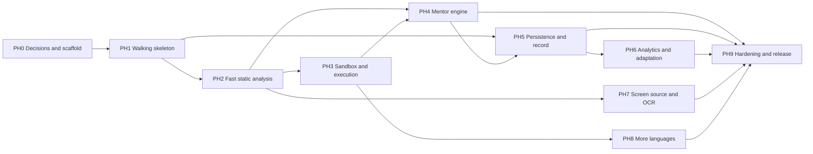

# 05 — Implementation Plan

> **Execution status (2026-10-06):** PH0–PH7 and PH9 are **implemented, tested and verified**.
> PH8 is a documented no-op (Q2 = Python only, ADR-0007). Per-phase evidence and the
> remaining limitations are in `11-FINAL-CHECKLIST.md`; measured numbers are in
> `02-STATUS.md` and the README.

Ten phases, built one at a time. Each phase lists the files it creates (generated from the manifest in `04-FOLDER-STRUCTURE.md`), its steps, how to verify it, when it is done and how to roll it back. **Nothing in this plan has been started.** Phases PH1 onward wait for your answers to Q1–Q7 and your "start Phase N".

## 1. How to use this plan

**Rules for every phase**

1. One phase per agent session, on its own branch `phase/<n>-<slug>`. Start with `CLAUDE.md`, `00-PROJECT-BRIEF.md` and only the current phase section.
2. Touch only the files the phase lists, plus minimal wiring changes to files from earlier phases that a step requires (for example registering a router in `backend/app/main.py`); report every such change. If any other file must change, stop and ask.
3. Pin dependency versions from the registry at the time of the step, and print them.
4. Run the phase's verification and paste the real output into the phase report.
5. Stop at the phase exit. Update the checklist in `11-FINAL-CHECKLIST.md`, wait for your confirmation, then tag `phase-<n>-complete`.
6. Gated items: a file or step tagged with a gate (for example Q3) is built only if the recorded answer needs it. PH0-S2 lists which gated items are in and which are out, so no phase builds something you ruled out.

**Phase report (every phase ends with this)**: what changed; files created or modified (from `git diff --stat`); dependencies added with versions; verification commands and output; deviations from the plan and why; uncertainties and anything that needed an assumption (assumptions need your approval); rollback tested yes or no; questions for you.

**Kickoff prompt** (your template, ready to paste with the phase number filled in):

```text
PROJECT: AI Real-Time Coding Screener / AI Coding Mentor
TOPIC: Execute Phase <n> only: <phase title>
CONTEXT: Read CLAUDE.md, docs/00-PROJECT-BRIEF.md, the Phase <n> section of docs/05-IMPLEMENTATION-PLAN.md and the architecture sections it names. Answers to open questions are in docs/10-OPEN-QUESTIONS.md and docs/adr/.
GOAL: <the phase Goal line>
CURRENT STATE: Report git status and the latest phase tag before changing anything.
REQUIREMENTS: <IDs from the phase Covers line>
CONSTRAINTS: Only the files listed for this phase. Stop and ask if another file must change.
AVAILABLE RESOURCES: As recorded in docs/00-PROJECT-BRIEF.md.
SCOPE: IN = the phase steps. OUT = everything else.
PRIORITIES: As in the phase header.
ASSUMPTIONS: None. Ask, or write UNKNOWN.
DELIVERABLES: Code and tests for this phase, updated docs, a phase report.
SUCCESS CRITERIA: The phase exit criteria.
RISKS / EDGE CASES: The risks in docs/09-RISKS-AND-EDGE-CASES.md that name this phase.
OUTPUT FORMAT: 1 Understanding, 2 Design notes, 3 Steps done, 4 Dependencies added with pinned versions, 5 Verification output, 6 Rollback notes, 7 Checklist.
EXECUTION RULES: Do not change unrelated files. Prefer existing components. Verify each major step. State uncertainties. Do not invent missing information. Stop at the phase exit.
```

## 2. Phase map

Sizes are relative effort (S smaller, L larger), not calendar time.

| Phase | Name | Size | Priority | Depends on | Needs answers |
|---|---|---|---|---|---|
| PH0 | Decisions and scaffold | S | P0 | none | Q1–Q7 |
| PH1 | Walking skeleton | M | P0 | PH0 | Q1 |
| PH2 | Fast static analysis | M | P0 | PH1 | Q2, Q11 |
| PH3 | Sandbox and execution | L | P0 | PH2 | Q2, Q3, Q5, Q11 |
| PH4 | Mentor engine | L | P0 | PH2, PH3 | Q4, Q8, Q13, Q14 |
| PH5 | Persistence and learner record | M | P0 | PH1, PH4 | Q5, Q10, Q12 |
| PH6 | Analytics, quality checks, adaptation | M | P1 | PH2, PH5 | Q9 |
| PH7 | Screen source, automatic code discovery and OCR | L | P1, or P0 if screen capture is required for evaluation | PH2 | Q1 |
| PH8 | Additional languages | M per language | P1 | PH2, PH3 | Q2, Q11 |
| PH9 | Hardening, evaluation, release | M | P0 | all phases in scope | Q5, Q6 |



Critical path: PH0, PH1, PH2, PH3, PH4, PH5, PH9. PH6, PH7 and PH8 branch off it and can be reordered, or cut, without breaking the core.

## 3. Timeline and milestones

No calendar dates are given: deadline, team size and weekly hours are unknown (Q6). Once known, phase sizes are mapped to weeks and scope is cut to fit.

| Milestone | Reached when | Phase | What you can see |
|---|---|---|---|
| M1 Skeleton alive | Real-time loop proven | PH1 | Type in the editor, a placeholder marker arrives over WebSocket, reconnect works |
| M2 Real markers | Real analysis, measured | PH2 | Syntax and lint markers as you type; latency report |
| M3 Safe to run | Sandbox proven | PH3 | Run button, runtime errors, test results; isolation tests green |
| M4 Mentor demo | First demonstrable product | PH4 | Scenarios S1–S6: hints H1–H4, fallback without the LLM |
| M5 Record | Progress is kept and shown | PH5, PH6 | Session history; dashboard |
| M6 Screen mode | If in scope | PH7 | Capture, consent, OCR-gated analysis |
| M7 Release candidate | Evidence collected | PH9 | Success criteria SC-1 to SC-8 evidenced |

If time is short, cut in this order (least damage first): extra languages beyond the first (PH8), adaptation (FR-18), quality and performance patterns (FR-08), screen source if Q1 allows editor-only (PH7), dashboard polish. Never cut: sandbox isolation tests, guardrails, consent and privacy controls, verification.

## 4. Resources and team needs

| Need | Detail |
|---|---|
| Decision maker and reviewer | You: answer Q1–Q7, confirm each phase exit, set quality targets after the PH2 baseline |
| Implementation | Coding-agent sessions, one per phase, guided by `CLAUDE.md`; team size and any other contributors are unknown (Q6) |
| Hardware | The laptop in `00-PROJECT-BRIEF.md`; running the LLM, database, runner and browser together is a resource contention to measure in PH3 and PH4 |
| Software | Docker with Compose, Git and GitHub, Node with pnpm, Python with uv, LM Studio (local models), VS Code |
| External | Hosted LLM account only if Q4 chooses it; GitHub Actions for CI; a Linux runner with Docker for the sandbox tests |
| People for testing | Optional learners for a small study if Q6 says the evaluation needs one |
| Budget | Unknown (Q4, Q6); local-only operation needs none beyond existing hardware |

## PH0 — Decisions and scaffold

**Goal:** Record every decision the build depends on, then create an empty but fully green skeleton: repository, tooling, CI and a database container. No product code.
**Priority / size:** P0 · S
**Depends on:** nothing
**Needs answers:** Q1–Q7 (blocking); Q11 and Q12 if answered
**Covers:** NFR-07, NFR-08

**Files created:**
- `CLAUDE.md` — Agent operating manual: status, execution rules, safety rules (delivered with this plan)
- `README.md` — Human quickstart; stub at PH0, finalised at PH9
- `.gitignore` — Ignore env files, caches, build output, eval reports
- `.env.example` — Every environment variable documented; contains no secrets
- `Makefile` — Task runner (D9); the underlying commands are listed in docs/06
- `docker-compose.yml` — PostgreSQL first; sandbox runner and optional services added in later phases
- `.github/workflows/ci.yml` — CI gates (D8): lint, type-check, tests, generated-types check, sandbox tests
- `docs/00-PROJECT-BRIEF.md` — Your template, filled in
- `docs/01-STACK-AND-ABSTRACT-REVIEW.md` — Verdict on every abstract claim and stack item
- `docs/02-REQUIREMENTS.md` — Requirement IDs, priorities, gates, phases
- `docs/03-ARCHITECTURE.md` — Components, flows, contracts, data model, safety design
- `docs/04-FOLDER-STRUCTURE.md` — Repo tree, import rules, file manifest
- `docs/05-IMPLEMENTATION-PLAN.md` — Phases, steps, verification, exit criteria
- `docs/06-DEPENDENCIES-AND-COMMANDS.md` — Dependencies, environment variables, commands
- `docs/07-TESTING-AND-VALIDATION.md` — Traceability matrix, suites, acceptance scenarios
- `docs/08-ROLLBACK-AND-FAILURE-HANDLING.md` — Phase rollback, kill switches, failure matrix
- `docs/09-RISKS-AND-EDGE-CASES.md` — Risk register and edge cases
- `docs/10-OPEN-QUESTIONS.md` — Questions, provisional defaults, decision log
- `docs/11-FINAL-CHECKLIST.md` — Readiness, phase-exit and release checklists
- `docs/12-REVIEW-LOG.md` — Record of the three review cycles
- `docs/adr/` — Architecture decision records: one per answered question or major choice
- `backend/pyproject.toml` — Python project and dependency pins (uv); Ruff, pytest and type-checker config
- `frontend/package.json` — Dependencies and scripts (pnpm)
- `frontend/vite.config.ts` — Vite config with Tailwind plugin and path alias
- `frontend/tsconfig.json` — TypeScript strict configuration
- `frontend/components.json` — shadcn/ui configuration
- `frontend/index.html` — App entry HTML
- `frontend/src/main.tsx` — App bootstrap
- `frontend/src/components/ui/` — shadcn/ui generated components
- `frontend/src/lib/utils.ts` — shadcn/ui class-name helper
- `frontend/src/test/setup.ts` — Vitest setup

**Steps**

1. PH0-S1 Re-scope check. Read the answers in `docs/10-OPEN-QUESTIONS.md`. If Q7 reveals existing assets, stop and update this plan before creating anything. Print the installed versions of git, docker and compose, node, pnpm, python and uv; list what is missing.
2. PH0-S2 Write one ADR in `docs/adr/` per answered blocking question, update the planning files so `[Qn]` markers become decisions, and list which gated files and steps are in or out.
3. PH0-S3 Create the root files `.gitignore`, `.env.example`, `Makefile`, `docker-compose.yml` (database service with a health check) and a stub `README.md`.
4. PH0-S4 Backend scaffold: `backend/pyproject.toml` with dependencies resolved from the registry and pinned, plus Ruff, pytest and type-checker configuration. No application code.
5. PH0-S5 Frontend scaffold: `frontend/package.json`, `vite.config.ts`, `tsconfig.json` (strict), `components.json`, `index.html`, `src/main.tsx`, `src/lib/utils.ts`, `src/test/setup.ts`; initialise Tailwind and shadcn/ui following their current official instructions (the commands in `06-DEPENDENCIES-AND-COMMANDS.md` are indicative).
6. PH0-S6 CI in `.github/workflows/ci.yml`: backend, frontend and generated-types jobs. The sandbox job is added in PH3. It must be green on the empty skeleton.
7. PH0-S7 Update the status line in `CLAUDE.md`, commit, tag `phase-0-complete`.

**Commands:** `make db-up`, `make check`
**Verification:** `make check` exits 0; the database container reports healthy; CI is green on the first push; every variable in use appears in `.env.example`.
**Exit criteria:** Q1–Q7 recorded as ADRs; skeleton green locally and in CI; no product code exists; versions printed and pinned.
**Rollback:** Nothing is deployed. Delete the branch or reset to the previous commit; `make db-down` removes the database container and its volume.

## PH1 — Walking skeleton

**Goal:** Typing in the editor produces a placeholder diagnostic from the backend over the WebSocket, with sequence numbers, latest-wins, reconnect and logging, proving the real-time loop and the contracts before any real analysis exists.
**Priority / size:** P0 · M
**Depends on:** PH0
**Needs answers:** Q1. If Q1 = B (screen only), the editor is used here as a test harness and later becomes the read-back view, and PH7 becomes P0 directly after PH2.
**Covers:** FR-01, FR-02, FR-03, NFR-04, NFR-06, NFR-09

**Files created:**
- `backend/app/__init__.py` — Package marker
- `backend/app/main.py` — App factory and composition root: routers, WS route, event subscriptions
- `backend/app/config.py` — Typed settings from environment (pydantic-settings)
- `backend/app/api/health.py` — Liveness and readiness endpoint
- `backend/app/ws/endpoint.py` — WebSocket route, Origin check, auth hook, message size limits
- `backend/app/ws/connection_manager.py` — One active connection per session; send helpers
- `backend/app/ws/handlers.py` — Turn client messages into events; send server messages
- `backend/app/core/logging.py` — Structured JSON logging with correlation IDs
- `backend/app/core/errors.py` — Error types and WS/REST error mapping
- `backend/app/core/events.py` — In-process typed async event bus
- `backend/app/schemas/snapshot.py` — CodeSnapshot model
- `backend/app/schemas/diagnostic.py` — Diagnostic, Range and Category models
- `backend/app/schemas/ws.py` — WebSocket envelope and payload models (source of the generated TypeScript types)
- `backend/app/schemas/export.py` — Export JSON Schema from the models for the TypeScript type generator
- `backend/app/ingest/snapshot.py` — Normalise and validate incoming snapshots
- `backend/app/ingest/coalescer.py` — Latest-wins coalescing per session using seq
- `backend/app/analysis/pipeline.py` — Fast-path orchestrator (stub in PH1, real analyzers from PH2)
- `backend/tests/conftest.py` — Shared fixtures (app, WS client, fake LLM, fake runner)
- `backend/tests/unit/` — Unit tests
- `backend/tests/integration/` — Integration tests (WebSocket flow, database, failure drills)
- `frontend/src/App.tsx` — App shell and router
- `frontend/src/routes/workspace.tsx` — Editor, diagnostics, run and mentor panels
- `frontend/src/features/editor/EditorPane.tsx` — Monaco editor bundled locally; emits debounced snapshots [gate Q1]
- `frontend/src/features/editor/markers.ts` — Diagnostics to Monaco markers
- `frontend/src/lib/ws/client.ts` — Typed WebSocket client with seq numbers
- `frontend/src/lib/ws/reconnect.ts` — Backoff, jitter and resync logic
- `frontend/src/store/session.ts` — Session, snapshot, diagnostics and issues state
- `frontend/src/types/generated/` — TypeScript types generated from backend schemas (never edited by hand)
- `frontend/e2e/` — Playwright end-to-end specs for acceptance scenarios

**Steps**

1. PH1-S1 Contracts: write `backend/app/schemas/snapshot.py`, `diagnostic.py` and `ws.py` per `03-ARCHITECTURE.md` section 6; `backend/app/schemas/export.py` writes JSON Schema; generate TypeScript into `frontend/src/types/generated/`; make CI fail when generated files are stale.
2. PH1-S2 Backend core: `backend/app/__init__.py`, `backend/app/main.py`, `config.py` (settings from `APP_ENV`, `LOG_LEVEL` and the other variables in `06-DEPENDENCIES-AND-COMMANDS.md` section 6), `api/health.py`, `core/logging.py`, `core/errors.py`, `core/events.py`.
3. PH1-S3 WebSocket: `ws/endpoint.py` (Origin allowlist from `ALLOWED_ORIGINS`; size limits P-10 from `MAX_SNAPSHOT_BYTES`, `MAX_FRAME_BYTES` and `MAX_MESSAGE_BYTES`), `connection_manager.py`, `handlers.py`; `ingest/snapshot.py` for validation and `ingest/coalescer.py` for one-slot latest-wins.
4. PH1-S4 Placeholder analysis: `analysis/pipeline.py` returns a deterministic marker when the text contains the literal `FAKE_ERROR`. PH2 replaces it.
5. PH1-S5 Frontend: `App.tsx`, `routes/workspace.tsx`, `features/editor/EditorPane.tsx` (Monaco bundled locally, debounce P-01), `features/editor/markers.ts`, `lib/ws/client.ts`, `lib/ws/reconnect.ts`, `store/session.ts`. The frontend reads `VITE_API_URL` and `VITE_WS_URL`.
6. PH1-S6 Tests: fixtures in `backend/tests/conftest.py`; unit tests (coalescer, schema validation, reconnect backoff, and an architecture test that enforces the layering and no-execution rules in `04-FOLDER-STRUCTURE.md` section 3); integration tests (out-of-order and stale `seq`, rejected Origin, oversize message, reconnect with resync through `session.resume`); an end-to-end smoke test in `frontend/e2e/` (type `FAKE_ERROR`, marker appears).
7. PH1-S7 Freeze contract v0 in an ADR.

**Commands:** `make types`, `make test`, `make e2e`, `make dev-backend`, `make dev-frontend`
**Verification:** `make types` leaves no diff in the generated folder; `make test` and `make e2e` pass; manually, with both dev servers running, type `FAKE_ERROR` and see the marker; stop the backend and see the banner; restart and see resync without duplicate markers.
**Exit criteria:** Contract v0 frozen; stale results are never applied (test); logs carry stage timings and no code (test); a disallowed Origin is rejected (test).
**Rollback:** Revert the phase branch. Contract changes after this phase need an ADR.

## PH2 — Fast static analysis

**Goal:** Replace the placeholder with real, measured syntax and lint analysis for Python, mapped to the taxonomy, with an evaluation harness and a latency baseline.
**Priority / size:** P0 · M
**Depends on:** PH1
**Needs answers:** Q2 (Python in scope), Q11 (interpreter version)
**Covers:** FR-04, FR-05, FR-09, NFR-01, NFR-05

**Files created:**
- `backend/app/analysis/taxonomy.py` — Mistake taxonomy and tool-rule mapping
- `backend/app/analysis/aggregator.py` — Dedupe, rank and fingerprint diagnostics
- `backend/app/analysis/python_ast.py` — Precise Python syntax errors via the standard library in a limited worker [gate Q2]
- `backend/app/analysis/treesitter/parser.py` — Tree-sitter parser registry per language
- `backend/app/analysis/treesitter/errors.py` — Extract ERROR and MISSING nodes as syntax diagnostics
- `backend/app/analysis/linters/base.py` — Linter wrapper interface
- `backend/app/analysis/linters/ruff_python.py` — Ruff wrapper (subprocess, JSON output) [gate Q2]
- `backend/tests/fixtures/broken_snippets/` — Learner-typical broken code shared by tests and evals
- `eval/README.md` — How to run and read evaluations
- `eval/datasets/code_bugs/` — Labelled buggy and clean snippets per language
- `eval/harness/run_eval.py` — Evaluation entry point (suites: analysis, hints, ocr)
- `eval/harness/metrics.py` — Precision, recall, CER and related metrics
- `eval/harness/report.py` — Write reports to eval/reports/
- `eval/harness/bench_latency.py` — Replay typing traces and measure latency percentiles
- `eval/reports/` — Generated reports (gitignored)

**Steps**

1. PH2-S1 Taxonomy and aggregation: `analysis/taxonomy.py` (categories from `03-ARCHITECTURE.md` section 6.4) and `analysis/aggregator.py` (dedupe, rank, fingerprint, issue matching per `03-ARCHITECTURE.md` section 5.4). Unit tests for fingerprint stability under edits elsewhere, line shifts and whitespace.
2. PH2-S2 Tree-sitter: `analysis/treesitter/parser.py` (grammar registry; pin grammar packages) and `errors.py` (ERROR and MISSING nodes to diagnostics). Test against `backend/tests/fixtures/broken_snippets/`.
3. PH2-S3 Precise Python syntax errors: `analysis/python_ast.py`, compile only, in a worker with timeout P-07 and a memory cap. Test pathological inputs: deep nesting, very long lines, null bytes.
4. PH2-S4 Ruff: `analysis/linters/base.py` and `ruff_python.py` (subprocess, stdin, JSON output, timeout P-07); map rule codes to categories; test the mapping for common rules and the cases where Ruff is missing or crashes.
5. PH2-S5 Real fast path: replace the placeholder in `analysis/pipeline.py`; run the analyzers listed in `ENABLED_ANALYZERS` concurrently outside the event loop; send stage timings with `analysis.fast`; `features/editor/markers.ts` maps severities.
6. PH2-S6 Evaluation scaffold: `eval/harness/run_eval.py`, `metrics.py`, `report.py`, `bench_latency.py`, `eval/README.md`; initial corpus in `eval/datasets/code_bugs/` including clean negatives so false positives are measured.
7. PH2-S7 Baseline: run the analysis suite and the latency benchmark, save the reports, record the baseline in an ADR, and ask you to set targets (SC-2, Q14).

**Commands:** `make test`, `make eval`, `make bench`
**Verification:** tests pass; the analysis eval prints per-category precision and recall with sample sizes; the benchmark prints p50 and p95 against P-02; a many-session concurrency test shows the event loop stays responsive.
**Exit criteria:** analyzers never block the event loop (test); timeouts and crashes are handled (tests); baseline numbers recorded with sample sizes; you have been asked for targets.
**Rollback:** Revert the branch; each analyzer can be disabled through `ENABLED_ANALYZERS`, restoring placeholder behaviour.

## PH3 — Sandbox and execution

**Goal:** Run learner code safely, turn runtime errors and test results into diagnostics, and prove the isolation with tests before anything else depends on it.
**Priority / size:** P0 · L
**Depends on:** PH2
**Needs answers:** Q2, Q3, Q5, Q11
**Covers:** FR-06, FR-07, FR-22, NFR-03, NFR-05, NFR-08

**Files created:**
- `backend/app/api/problems.py` — Problem and test-case endpoints (only if Q3 includes a bank) [gate Q3]
- `backend/app/schemas/problem.py` — Problem and TestCase models [gate Q3]
- `backend/app/schemas/run.py` — RunRequest and RunResult models
- `backend/app/execution/client.py` — HTTP client for the sandbox runner (timeouts, circuit breaker)
- `backend/app/execution/result_parser.py` — Runner output to runtime Diagnostics (traceback line mapping)
- `backend/app/execution/test_runner.py` — Run test cases and compare output (only if Q3 includes tests) [gate Q3]
- `backend/app/problems/store.py` — ProblemStore interface: file-backed in PH3, database-backed from PH5 [gate Q3]
- `backend/app/problems/seed/` — Seed problems and test cases as data files (hidden flags, limits) [gate Q3]
- `frontend/src/features/run/RunPanel.tsx` — Run button, stdin, output and status
- `frontend/src/features/run/TestResults.tsx` — Test case results (hidden tests show pass or fail only) [gate Q3]
- `frontend/src/features/problems/ProblemPanel.tsx` — Problem picker and statement view [gate Q3]
- `sandbox/README.md` — Threat model, policy and how to run the runner
- `sandbox/pyproject.toml` — Runner dependencies, separate from the API
- `sandbox/runner/app.py` — Runner service: accepts jobs, enforces policy, returns results
- `sandbox/runner/policy.py` — Limits and container flags (time, memory, PIDs, output, no network)
- `sandbox/runner/languages.py` — Per-language compile and run command templates [gate Q2]
- `sandbox/images/python/Dockerfile` — Python sandbox image (non-root, minimal) [gate Q2]
- `sandbox/tests/` — Isolation and limit tests (must pass before merge)

**Steps**

1. PH3-S1 Isolation decision: write the threat model in `sandbox/README.md` and record an ADR choosing the isolation level for the answer to Q5 (hardened containers for local use; evaluate stronger options if hosted, per `03-ARCHITECTURE.md` section 9.4).
2. PH3-S2 Python image `sandbox/images/python/Dockerfile` (non-root, minimal, no network tools) and `sandbox/pyproject.toml`.
3. PH3-S3 Runner: `sandbox/runner/app.py`, `policy.py`, `languages.py` implementing `03-ARCHITECTURE.md` section 9: job API, shared-secret auth (`SANDBOX_SECRET`), limits P-08, concurrency P-09, kill on timeout, output caps, container removal; add the runner service to `docker-compose.yml` on an internal network only.
4. PH3-S4 Isolation and limit tests in `sandbox/tests/` (must pass before merge and in CI on Linux): infinite loop killed; memory bomb; fork bomb; network blocked; writes outside the work directory blocked; large output truncated; runs as non-root; no host paths or Docker socket visible; containers removed after each job.
5. PH3-S5 API side: `execution/client.py` (address from `SANDBOX_URL`, timeouts, circuit breaker, honours `EXECUTION_ENABLED`), `execution/result_parser.py` (exception to category, traceback line), `execution/test_runner.py` (Q3); schemas in `backend/app/schemas/run.py`.
6. PH3-S6 Problems (Q3): `backend/app/schemas/problem.py`, `problems/store.py`, `problems/seed/`, `api/problems.py`; hidden tests never serialise expected output.
7. PH3-S7 Frontend: `features/run/RunPanel.tsx`, `features/run/TestResults.tsx`, `features/problems/ProblemPanel.tsx` (problem picker and statement, Q3); runner states shown (busy, unavailable).
8. PH3-S8 Integration tests with a fake runner and the real runner; failure drill with the runner stopped; add the sandbox job to `.github/workflows/ci.yml`.

**Commands:** `make sandbox-build`, `make test-sandbox`, `make test`
**Verification:** isolation suite passes; scenarios S3, S4 and S5 pass manually; the API stays responsive during an infinite loop; the API container has no Docker socket.
**Exit criteria:** every isolation and limit test passes on Linux with Docker; runtime diagnostics point at the right line; hidden test data never reaches the client (test).
**Rollback:** set `EXECUTION_ENABLED=false` (kill switch), revert the branch, `make db-down` and stop runner containers.

## PH4 — Mentor engine

**Goal:** Turn verified diagnostics into progressive, guard-railed hints with a working fallback when the LLM is unavailable, using a model chosen by measurement.
**Priority / size:** P0 · L
**Depends on:** PH2, PH3
**Needs answers:** Q4, Q8, Q13, Q14
**Covers:** FR-10, FR-11, FR-12, FR-13, FR-14, FR-23, NFR-02, NFR-04, NFR-05, NFR-11

**Files created:**
- `backend/app/core/limits.py` — Rate limits and LLM/run budgets
- `backend/app/schemas/hint.py` — Hint, level and mentor-output models
- `backend/app/ingest/redaction.py` — Secret redaction before any LLM call
- `backend/app/mentor/engine.py` — Orchestrates trigger, prompt, LLM, guardrails, hint
- `backend/app/mentor/trigger_policy.py` — When to speak: settle, persist, cooldown, explicit, proactivity
- `backend/app/mentor/hint_ladder.py` — Per-issue hint-level state machine (H1 to H4) [gate Q13]
- `backend/app/mentor/prompt_builder.py` — Build delimited prompts from verified inputs
- `backend/app/mentor/prompts/system.md` — Versioned system prompt
- `backend/app/mentor/prompts/hint_levels.md` — Versioned per-level instructions [gate Q13]
- `backend/app/mentor/guardrails.py` — Schema, level-compliance, grounding and leakage checks; retry and fallback
- `backend/app/mentor/fallback_explanations.py` — Template explanations per category for H1 to H3 (no LLM needed) [gate Q8]
- `backend/app/mentor/cache.py` — Hint cache keyed by code, diagnostics, level, prompt version and model
- `backend/app/mentor/llm/base.py` — LLMProvider interface and result types
- `backend/app/mentor/llm/openai_compatible.py` — Adapter for LM Studio, Ollama, vLLM and hosted OpenAI-compatible APIs [gate Q4]
- `backend/app/mentor/llm/registry.py` — Provider selection from settings [gate Q4]
- `backend/tests/adversarial/` — Guardrail and prompt-injection tests
- `frontend/src/routes/settings.tsx` — Mentor proactivity and display settings
- `frontend/src/features/mentor/MentorPanel.tsx` — Issues list, hint ladder controls, notices
- `frontend/src/features/mentor/HintCard.tsx` — Hint display with sanitised rendering and feedback buttons
- `frontend/src/features/mentor/FloatingMentor.tsx` — Core floating mentor surface, draggable and dismissible
- `frontend/src/features/mentor/overlayPosition.ts` — Geometry-based placement helper; activated for screen mode in PH7
- `frontend/src/store/settings.ts` — User settings state
- `eval/harness/judges.py` — Automatic hint checks and optional LLM-judge scoring

**Steps**

1. PH4-S1 Bake-off: build the golden hint set from `eval/datasets/code_bugs/`; implement `eval/harness/judges.py`; run each candidate model and record the metrics in `03-ARCHITECTURE.md` section 8.5; choose a default and a fallback in an ADR.
2. PH4-S2 Provider: `mentor/llm/base.py`, `openai_compatible.py`, `registry.py` with timeouts and retry P-11, circuit breaker, readiness check against the model list. Configured by `LLM_ENABLED`, `LLM_PROVIDER`, `LLM_BASE_URL`, `LLM_API_KEY`, `LLM_MODEL` and `LLM_CONTEXT_TOKENS`.
3. PH4-S3 Ladder and trigger policy: `mentor/hint_ladder.py` and `trigger_policy.py` as pure, exhaustively unit-tested state machines (every row of `03-ARCHITECTURE.md` section 8.1).
4. PH4-S4 Prompts and redaction: `mentor/prompts/system.md`, `hint_levels.md`, `mentor/prompt_builder.py`, `ingest/redaction.py`; delimiter neutralisation.
5. PH4-S5 Guardrails: `mentor/guardrails.py`, `fallback_explanations.py`, `cache.py`; adversarial tests in `backend/tests/adversarial/`: instructions hidden in comments, requests for the solution, fenced code in output, wrong line references, invalid JSON, empty and over-long output.
6. PH4-S6 Engine: `mentor/engine.py` wiring events to trigger, prompt, LLM, guardrails and `hint.final`; `core/limits.py` for rate limits and budgets (`HOSTED_LLM_BUDGET_SESSION`, `HOSTED_LLM_BUDGET_DAY`, P-15); `schemas/hint.py`; `hint.feedback` handling; a hint whose issue was resolved or changed while the model was answering is dropped.
7. PH4-S7 Frontend: `features/mentor/MentorPanel.tsx`, `HintCard.tsx`, `FloatingMentor.tsx` (text rendering, feedback buttons, "More help", confirmed "Reveal"), `routes/settings.tsx`, `store/settings.ts` (proactivity, default from `MENTOR_PROACTIVITY_DEFAULT`). The overlay must work in editor mode even before screen tracking is enabled; geometry-based screen positioning is wired in PH7.
8. PH4-S8 Failure drills: LLM stopped, LLM slow, invalid output, budget exhausted (hosted); each must end in a template hint and a notice.

**Commands:** `make test`, `make eval`, `make dev-backend`, `make dev-frontend`
**Verification:** unit, integration and adversarial suites pass; the hints eval prints guardrail pass rate, grounding errors and latency per model; scenarios S1–S6 pass.
**Exit criteria:** no fenced code at H1–H3 in any adversarial or eval case (deterministic check); grounding failures are caught and handled; `LLM_ENABLED=false` yields template-only mode; the model choice is an ADR backed by the bake-off; mentor latency is measured and reported (NFR-02).
**Rollback:** `LLM_ENABLED=false`, revert the branch; prompts are versioned in git, so a prompt regression is reverted like code.

## PH5 — Persistence and learner record

**Goal:** Keep sessions, issues, hints and runs per learner, restart-safe, with retention and identity handled as decided.
**Priority / size:** P0 · M
**Depends on:** PH1, PH4
**Needs answers:** Q5, Q10, Q12
**Covers:** FR-15, FR-16, FR-21, FR-23, NFR-04, NFR-05, NFR-09

**Files created:**
- `backend/alembic.ini` — Alembic configuration
- `backend/migrations/env.py` — Alembic environment (async engine)
- `backend/migrations/versions/` — Migration scripts, each with a working downgrade
- `backend/app/api/sessions.py` — Session history endpoints
- `backend/app/core/security.py` — Identity and auth: single local profile or authenticated users [gate Q5]
- `backend/app/learner/tracking.py` — Issue lifecycle and checkpoint persistence driven by events
- `backend/app/db/base.py` — Declarative base and naming conventions
- `backend/app/db/session.py` — Async engine and session factory [gate Q12]
- `backend/app/db/models.py` — ORM models per `03-ARCHITECTURE.md` section 7
- `backend/app/db/repositories.py` — The only module that runs queries
- `frontend/src/routes/history.tsx` — Session and issue history: the learner's record of mistakes
- `frontend/src/lib/api/client.ts` — Typed REST client

**Steps**

1. PH5-S1 Database layer (`DATABASE_URL`): `db/base.py`, `session.py`, `models.py`, `repositories.py`, `backend/alembic.ini`, `backend/migrations/env.py`; first migration in `backend/migrations/versions/` for `03-ARCHITECTURE.md` section 7; test upgrade and downgrade on an empty database.
2. PH5-S2 Learner tracking: `learner/tracking.py` subscribes to events; issue open, update, resolve; checkpoints on run, hint request, resolve and session end; honours `STORE_CODE_TEXT` and `RETENTION_DAYS`; stores code text only after redaction (`ingest/redaction.py`); purge task.
3. PH5-S3 Identity: `core/security.py` per Q5 and `AUTH_MODE` (single local profile or authenticated users), decided in an ADR first.
4. PH5-S4 REST, history and resume: `api/sessions.py`, `lib/api/client.ts`, `routes/history.tsx` (the learner's record of sessions and mistakes); `session.resume` restores issues after a restart.
5. PH5-S5 Problems move from files to the database (import the seeds), behind the same store interface.
6. PH5-S6 Security baseline: rate limits and quotas in `core/limits.py`, Origin and size checks re-tested, dependency audit job in CI.
7. PH5-S7 Failure drills: database stopped mid-session (session continues in memory, banner, bounded retry queue); backend restart mid-session; delete-my-data.

**Commands:** `make db-up`, `make db-migrate`, `make test`
**Verification:** migrations upgrade and downgrade; integration tests run against real PostgreSQL; a scripted session produces the expected rows; privacy tests prove no raw frames and no code in logs by default (SC-6).
**Exit criteria:** SC-6 passes; the record survives a restart; downgrade tested; the database-stopped drill passes.
**Rollback:** back up first (command in `08-ROLLBACK-AND-FAILURE-HANDLING.md`), then `alembic downgrade`; revert the branch.

## PH6 — Analytics, quality checks, adaptation

**Goal:** Show progress and add the P1 intelligence: quality and performance findings, the dashboard, and rule-based adaptation.
**Priority / size:** P1 · M
**Depends on:** PH2, PH5
**Needs answers:** Q9
**Covers:** FR-08, FR-17, FR-18

**Files created:**
- `backend/app/api/progress.py` — Progress and analytics endpoints [P1]
- `backend/app/analysis/treesitter/queries/` — Tree-sitter queries for quality and performance patterns [P1]
- `backend/app/analysis/quality/complexity.py` — Complexity and nesting metrics [P1]
- `backend/app/analysis/quality/patterns.py` — Performance and quality pattern detectors [P1]
- `backend/app/learner/metrics.py` — Progress metric queries [P1, gate Q9]
- `backend/app/learner/adaptation.py` — Rule-based hint adaptation from the mistake record [P1]
- `frontend/src/routes/progress.tsx` — Progress dashboard route [P1]
- `frontend/src/features/progress/ProgressDashboard.tsx` — Charts built with shadcn/ui chart components [P1]

**Steps**

1. PH6-S1 Quality analyzers: `analysis/quality/complexity.py`, `patterns.py`, and queries in `analysis/treesitter/queries/`; extend the corpus; severities `info` or `warning`.
2. PH6-S2 Metrics: `learner/metrics.py` implements the confirmed set from `03-ARCHITECTURE.md` section 11; `api/progress.py` exposes it.
3. PH6-S3 Dashboard: `routes/progress.tsx` and `features/progress/ProgressDashboard.tsx` using shadcn/ui charts.
4. PH6-S4 Adaptation: `learner/adaptation.py` (switch `ADAPTATION_ENABLED`) with unit tests per rule; feed the profile summary into `mentor/prompt_builder.py`.
5. PH6-S5 Verify SC-7 by comparing dashboard numbers with direct SQL on scripted sessions.

**Commands:** `make test`, `make eval`
**Verification:** metric tests; quality analyzers evaluated on the corpus; SC-7 comparison.
**Exit criteria:** dashboard equals direct SQL; adaptation rules are deterministic and tested; quality findings do not raise false-positive rates on clean negatives beyond what you accept.
**Rollback:** `ADAPTATION_ENABLED=false`; hide the dashboard route; revert the branch.

## PH7 — Screen source, automatic code discovery, tracking and OCR

**Goal:** Add the screen source behind the same snapshot contract, automatically discover and track the learner's most likely code/editor region, fall back to manual selection when confidence is low, and add privacy controls and OCR confidence gating using an engine chosen by measurement.
**Priority / size:** P1, or P0 if screen capture is required for evaluation · L
**Depends on:** PH2, PH4
**Needs answers:** Q1
**Covers:** FR-19, FR-20, FR-27, FR-28, NFR-04, NFR-05

**Files created:**
- `backend/app/vision/frame_decode.py` — Decode and validate incoming frames [P1, gate Q1]
- `backend/app/vision/preprocess.py` — OpenCV preprocessing for region discovery and OCR [P1, gate Q1]
- `backend/app/vision/code_region_detect.py` — Rank candidate code/editor regions using multi-signal visual and structural features [P1, gate Q1]
- `backend/app/vision/region_tracking.py` — Track the selected region across frames and reacquire after movement [P1, gate Q1]
- `backend/app/vision/ocr/base.py` — OCR engine interface (the engine file is added after the bake-off) [P1, gate Q1]
- `backend/app/vision/code_reconstruct.py` — Lines and indentation from OCR boxes; strip gutters and line numbers [P1, gate Q1]
- `backend/app/vision/language_detect.py` — Language guess by parse score when not declared [P1, gate Q1]
- `frontend/src/features/capture/CapturePanel.tsx` — Share, automatic discovery status, manual override, pause, stop, indicator, and read-back view [P1, gate Q1]
- `frontend/src/features/capture/useScreenCapture.ts` — getDisplayMedia lifecycle and sampling [P1, gate Q1]
- `frontend/src/features/capture/frameDiff.ts` — Client-side change and settle detection [P1, gate Q1]
- `frontend/src/features/capture/ConsentDialog.tsx` — Explicit consent before any capture [P1, gate Q1]
- `frontend/src/features/mentor/overlayPosition.ts` — Map detected code-region geometry to safe floating-overlay coordinates [P1, gate Q1]
- `eval/datasets/code_regions/` — Screenshots with ground-truth region geometry and distractors [P1, gate Q1]
- `eval/datasets/ocr_screens/` — Screenshots with ground-truth text [P1, gate Q1]

**Steps**

1. PH7-S1 Feasibility spike on your browser and OS: `getDisplayMedia` behaviour, background-tab sampling, capture-frame dimensions, region geometry and frame framing for the WebSocket; record in an ADR. Sets P-13 and confirms the coordinate model for FR-27/28.
2. PH7-S2 Automatic code-discovery evaluation: build `eval/datasets/code_regions/` with VS Code, PyCharm, Jupyter, browser IDEs, coding challenge sites, terminals, themes, fonts, zoom levels, split panes and non-code distractors. Compare a multi-signal baseline against any candidate vision model only if the baseline is inadequate. Measure region precision/recall, intersection-over-union, reacquisition rate, false-region rate and latency. Set P-16 and record the decision.
3. PH7-S3 OCR bake-off: build and extend `eval/datasets/ocr_screens/`; compare Tesseract, at least one other open-source engine and optionally a vision-language model; metrics are character error rate, line accuracy, indentation accuracy, downstream parse success, false-diagnostic rate and latency. Choose the engine and set P-14; record an ADR.
4. PH7-S4 Backend pipeline: `vision/frame_decode.py`, `preprocess.py`, `code_region_detect.py`, `region_tracking.py`, `code_reconstruct.py`, `language_detect.py`, `ocr/base.py` plus one engine file for the chosen OCR engine; low region/OCR confidence yields `source.notice` and no diagnostics. The module is active only when `FEATURE_SCREEN_SOURCE` is true.
5. PH7-S5 Frontend capture and overlay: `features/capture/ConsentDialog.tsx`, `CapturePanel.tsx`, `useScreenCapture.ts`, `frameDiff.ts`, and `mentor/overlayPosition.ts`; show discovery/tracking state, permit manual override, keep an always-visible capture indicator, and position the floating mentor near the affected code without obscuring it. Frames are sent only after settle.
6. PH7-S6 Screen privacy and failure tests: no frames persisted, no OCR text in logs, no capture before consent, pause stops frames, lost-region state produces no diagnostics, manual fallback works, and the floating overlay cannot block the code area beyond P-17.
7. PH7-S7 Scenario S8 plus automatic-discovery scenarios: correct editor selected among distractors, editor moved/resized, wrong-region candidate, reacquisition after temporary loss, and unreadable code. Record detection, OCR, end-to-end and mentor-placement latency.

**Commands:** `make eval`, `make e2e`, `make test`
**Verification:** automatic-region evaluation report; OCR eval report; privacy tests; scenario S8 and the additional screen-discovery scenarios.
**Exit criteria:** automatic discovery meets the agreed baseline after measurement; low-confidence region or OCR paths produce no diagnostics; capture consent is tested; manual override works; floating mentor placement remains readable; `FEATURE_SCREEN_SOURCE` defaults to false.
**Rollback:** `FEATURE_SCREEN_SOURCE=false`; optionally disable `AUTO_CODE_DISCOVERY_ENABLED`; the vision and screen-overlay modules are isolated so the editor source remains unaffected.

## PH8 — Additional languages

**Goal:** Add each language chosen in Q2 to the same standard as Python.
**Priority / size:** P1 · M per language
**Depends on:** PH2, PH3
**Needs answers:** Q2, Q11
**Covers:** FR-24

**Files created:**
- `backend/app/analysis/linters/cpp.py` — C++ linter wrapper (only if Q2 includes C++) [P1, gate Q2]
- `backend/app/analysis/linters/java.py` — Java linter wrapper (only if Q2 includes Java) [P1, gate Q2]
- `sandbox/images/cpp/Dockerfile` — C++ sandbox image (only if Q2 includes C++) [P1, gate Q2]
- `sandbox/images/java/Dockerfile` — Java sandbox image (only if Q2 includes Java) [P1, gate Q2]

**Files modified:** `backend/app/analysis/treesitter/parser.py`, `backend/app/analysis/taxonomy.py`, `sandbox/runner/languages.py`, `backend/app/mentor/fallback_explanations.py`, `eval/datasets/code_bugs/`.

**Steps** (repeat per language)

1. PH8-S1 Grammar and linter: register the Tree-sitter grammar and add the language to `ENABLED_LANGUAGES`; add the linter wrapper (`analysis/linters/cpp.py` or `java.py`) with rule-to-category mapping.
2. PH8-S2 Sandbox: add the image (`sandbox/images/cpp/Dockerfile` or `java/Dockerfile`) and the command templates; extend the isolation tests to the new image.
3. PH8-S3 Mentor: add fallback templates for the language's common categories.
4. PH8-S4 Corpus and eval: add labelled cases and a clean-negative set; record the baseline.

**Commands:** `make sandbox-build`, `make test-sandbox`, `make eval`
**Verification:** isolation suite on the new image; analysis eval baseline; scenarios S1–S5 for that language.
**Exit criteria:** each added language meets the same gates as Python.
**Rollback:** remove it from `ENABLED_LANGUAGES`; revert the branch.

## PH9 — Hardening, evaluation, release

**Goal:** Collect the evidence for every success criterion, close the security and accessibility baselines, and make the project runnable by someone else from the documentation.
**Priority / size:** P0 · M
**Depends on:** every phase in scope
**Needs answers:** Q5, Q6
**Covers:** NFR-01, NFR-02, NFR-09, NFR-10

**Files created:**
- `backend/Dockerfile` — API container image for deployment [P1]
- `frontend/Dockerfile` — Production build image [P1]

**Steps**

1. PH9-S1 Full latency benchmark against P-02 and mentor latency per model; record in the docs.
2. PH9-S2 Security review against the table in `03-ARCHITECTURE.md` section 10: Origin, size and rate-limit tests, dependency audit, secret scan, sandbox re-test on a clean machine; apply the stronger isolation decision if the app is hosted.
3. PH9-S3 Accessibility pass: keyboard operation, contrast and labels for the hint panel, run panel and charts, with automated checks plus a manual keyboard pass.
4. PH9-S4 Deployment per Q5: a single-command local bring-up, or hosted images using `backend/Dockerfile` and `frontend/Dockerfile`, with environment checks and database backups.
5. PH9-S5 Documentation: final `README.md`, complete ADRs, a demo script covering the in-scope scenarios.
6. PH9-S6 Optional learner study if Q6 requires one (protocol in `07-TESTING-AND-VALIDATION.md`).
7. PH9-S7 Run `11-FINAL-CHECKLIST.md`, review open risks, tag the release candidate.

**Commands:** `make bench`, `make check`, `make test`, `make test-sandbox`, `make e2e`
**Verification:** every success criterion SC-1 to SC-8 has evidence attached; every P0 requirement has a passing test (matrix in `07-TESTING-AND-VALIDATION.md`).
**Exit criteria:** evidence complete; a clean checkout runs using the documented commands only; open risks reviewed with you.
**Rollback:** tag-based: return to the last phase tag; feature flags disable optional modules; database downgrade as in `08-ROLLBACK-AND-FAILURE-HANDLING.md`.

## Deferred (backlog)

**Covers:** FR-25, FR-26

Not scheduled. Each item has a trigger for pulling it in.

| Item | Trigger |
|---|---|
| RAG over curated explanations (pgvector) | Hint evals show factual gaps the model cannot fill from the code and diagnostics (FR-25) |
| VS Code extension source | Q1 selects it (FR-26) |
| Token streaming with an incremental guardrail | Measured hint latency is the main complaint |
| Delta snapshots | Snapshot size or bandwidth becomes a measured problem |
| Pylint as a second Python linter | Ruff misses checks the learners need |
| Auto-run of test cases on idle | Learners ask for it and the sandbox load allows it |
| In-browser Python execution | Q2 = Python only and Q5 = hosted |
| Metrics endpoint and dashboards for operations | The app is hosted for others |
| Additional explanation languages | Q8 asks for them |
