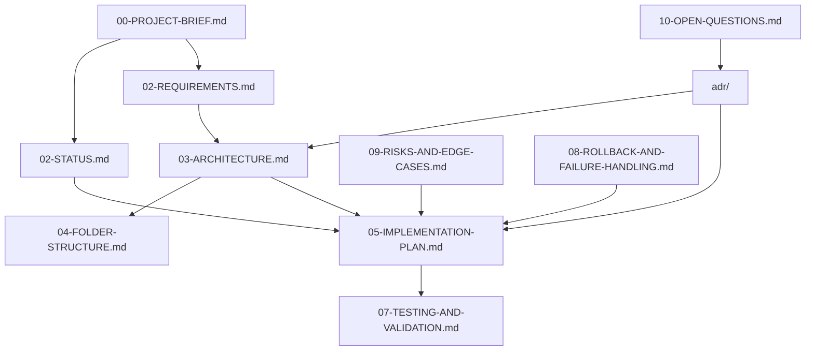

# ICM Routing Guide - AI Real-Time Coding Screener

**Navigation paths for developers and agents**

## Quick Access Routes

### For New Contributors
```
Start Here → 00-PROJECT-BRIEF.md → 02-STATUS.md → Current Phase Section
```

### For Implementation Work
```
Current Status → 02-STATUS.md → Phase Plan → 05-IMPLEMENTATION-PLAN.md → Architecture → 03-ARCHITECTURE.md
```

### For Architecture Decisions
```
Questions → 10-OPEN-QUESTIONS.md → Decisions → adr/ → Implementation → 05-IMPLEMENTATION-PLAN.md
```

### For Testing & Validation
```
Requirements → 02-REQUIREMENTS.md → Test Strategy → 07-TESTING-AND-VALIDATION.md → Acceptance Criteria
```

## Document Dependencies



## Phase-Based Navigation

### Phase 0 - Infrastructure Setup
**Current Focus:** Core development environment
- **Entry Point:** `02-STATUS.md` → Current Phase section
- **Implementation:** `05-IMPLEMENTATION-PLAN.md` → Phase 0 steps
- **Architecture:** `04-FOLDER-STRUCTURE.md` → Repository layout
- **Validation:** `11-FINAL-CHECKLIST.md` → Phase 0 exit criteria

### Future Phases
- **Phase 1:** Core pipeline and WebSocket integration
- **Phase 2:** Analysis tools and performance benchmarks  
- **Phase 3:** Sandbox execution and problem bank
- **Phase 4:** Mentor engine and LLM integration

## Component-Based Routes

### Backend Development
```
Architecture → 03-ARCHITECTURE.md (Section 3: Components)
↓
Structure → 04-FOLDER-STRUCTURE.md (backend/ tree)
↓  
Dependencies → 06-DEPENDENCIES-AND-COMMANDS.md (Python setup)
↓
Implementation → 05-IMPLEMENTATION-PLAN.md (current phase)
```

### Frontend Development  
```
Requirements → 02-REQUIREMENTS.md (FR-02, UI requirements)
↓
Architecture → 03-ARCHITECTURE.md (Section 3: Browser components)
↓
Structure → 04-FOLDER-STRUCTURE.md (frontend/ tree)
↓
Implementation → 05-IMPLEMENTATION-PLAN.md (current phase)
```

### Security & Sandbox
```
Requirements → 02-REQUIREMENTS.md (NFR security section)
↓
Architecture → 03-ARCHITECTURE.md (Section 9: Sandbox)
↓
Threat Model → 03-ARCHITECTURE.md (Section 9.1)
↓
Implementation → 05-IMPLEMENTATION-PLAN.md (Phase 3)
```

## Problem-Solving Routes

### Performance Issues
```
Requirements → 02-REQUIREMENTS.md (NFR-01: <1s latency)
↓
Architecture → 03-ARCHITECTURE.md (Section 5: Real-time pipeline)  
↓
Parameters → 03-ARCHITECTURE.md (Section 12: Provisional parameters)
↓
Testing → 07-TESTING-AND-VALIDATION.md (Performance benchmarks)
```

### Security Concerns
```
Principles → 03-ARCHITECTURE.md (Section 1: Principle 4)
↓
Threat Model → 03-ARCHITECTURE.md (Section 9.1)
↓
Controls → 03-ARCHITECTURE.md (Section 10: Security table)
↓
Testing → 07-TESTING-AND-VALIDATION.md (Security test suites)
```

### Integration Questions
```
Contracts → 03-ARCHITECTURE.md (Section 6: Contracts)
↓
Data Models → 03-ARCHITECTURE.md (Section 7: Data model)
↓
Implementation → 04-FOLDER-STRUCTURE.md (Import rules)
↓
Testing → 07-TESTING-AND-VALIDATION.md (Integration tests)
```

## Maintenance Routes

### Status Updates
```
Complete Task → Update 02-STATUS.md → Update Phase Progress → Check Exit Criteria
```

### Decision Recording
```
Make Decision → Create ADR → Update 10-OPEN-QUESTIONS.md → Update affected docs
```

### Architecture Changes
```
Identify Change → Create ADR → Update 03-ARCHITECTURE.md → Update affected plans
```

## Agent-Specific Routing

### For Claude Code
```
1. Always check: 02-STATUS.md (current phase)
2. Read relevant: 05-IMPLEMENTATION-PLAN.md (phase section)  
3. Reference: 04-FOLDER-STRUCTURE.md (file locations)
4. Follow: Execution rules in CLAUDE.md
```

### For ICM Architect Agent
```
1. Structure analysis: ICM-INDEX.md → Document catalog
2. Gap identification: Compare existing vs planned structure
3. Organization: Update index and routing as needed
```

### For MVC Structure Agent  
```
1. Code organization: 04-FOLDER-STRUCTURE.md → Dependency rules
2. Component design: 03-ARCHITECTURE.md → Component view
3. Implementation: 05-IMPLEMENTATION-PLAN.md → Current phase
```

## External Integration Routes

### GitHub Repository
```
Local Changes → Create ADR → Update docs → Commit with attribution
```

### MCP Servers
- **GitHub:** Repository management, PR creation, issue tracking
- **Obsidian:** Knowledge management, note linking
- **Reticle:** Browser testing, UI verification

### Skills Integration
- **icm-architect:** Project structure organization
- **icm-mvc-structure:** Code architecture setup  
- **web-design-guidelines:** UI/UX standards
- **vercel-react-best-practices:** Frontend patterns

## Emergency Routes

### Build Failures
```
Error → 08-ROLLBACK-AND-FAILURE-HANDLING.md → Recovery procedures
```

### Scope Creep
```
New Request → 02-REQUIREMENTS.md → Priority check → 09-RISKS-AND-EDGE-CASES.md
```

### Performance Regression
```
Issue → 07-TESTING-AND-VALIDATION.md → Performance benchmarks → Root cause analysis
```

## Validation Routes

### Before Phase Completion
```
Implementation Complete → 11-FINAL-CHECKLIST.md → Phase exit criteria → Verification commands
```

### Before Architecture Changes
```
Proposed Change → 09-RISKS-AND-EDGE-CASES.md → Impact analysis → ADR creation
```

### Before External Sharing
```
Content Ready → Review for secrets/sensitive data → Update status → Share documentation links
```

---

**Usage Note:** This routing guide helps navigate the ICM documentation efficiently. Follow the suggested paths based on your current task and role. Update this guide when adding new documentation or changing the project structure.